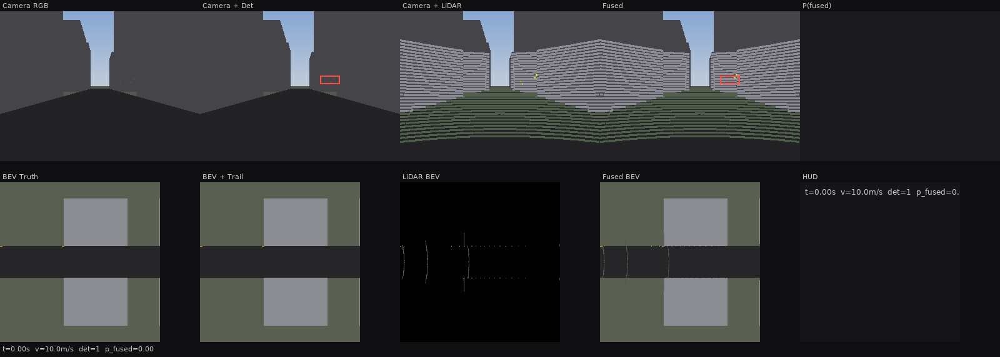
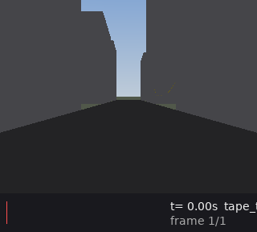
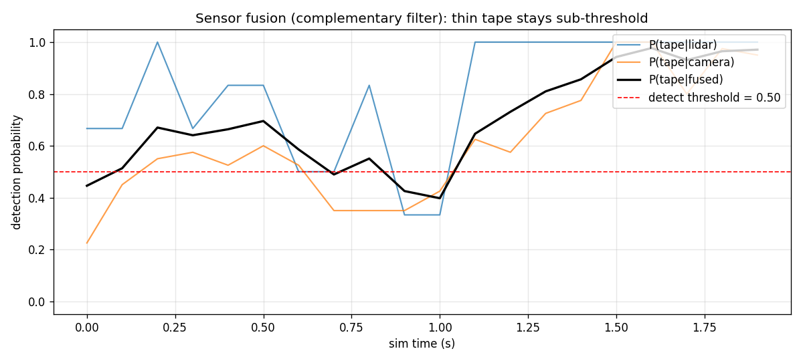
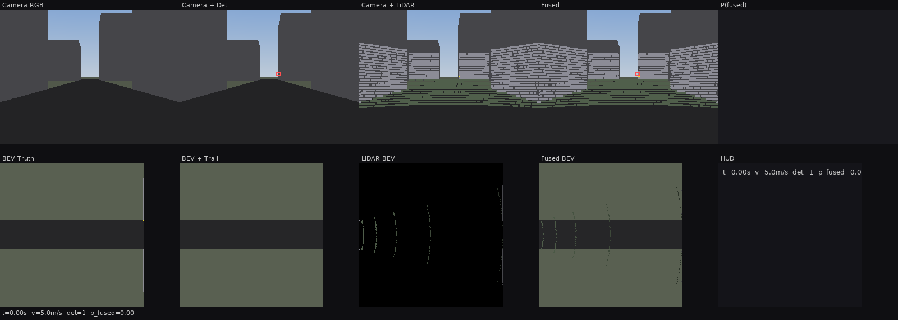
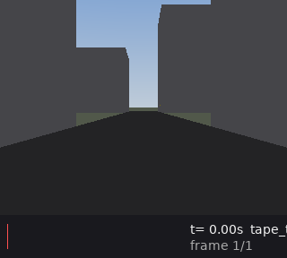
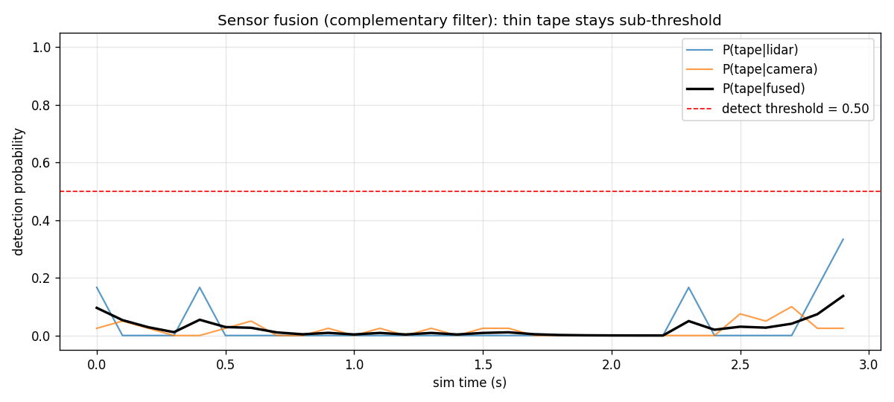
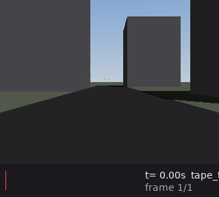
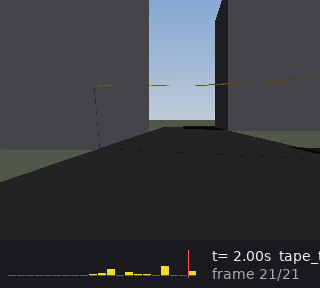

# oasis-sim-av

Lightweight Python simulator for autonomous-driving **sensor-fusion edge cases**.

Built to reproduce and study a specific failure mode: **thin, fluttering objects
(e.g. police/crime-scene tape) slipping through the gaps in LiDAR scans and
washing out in camera frames** due to motion blur and resolution limits, especially
in noisy environmental conditions (rain, dust).

## What it models

| Module            | Physics / math                                                                  |
|-------------------|---------------------------------------------------------------------------------|
| `world.py`        | Axis-aligned-bounding-box (AABB) city + ground plane + road polygons            |
| `vehicle.py`      | Kinematic bicycle model; controllers accept an optional `percept` kwarg so they can react to fusion confidence (SIM-011) |
| `cloth.py`        | 3D mass-spring grid for the tape, symplectic Euler integration, wind forcing    |
| `geometry.py`     | Vectorized ray-AABB slab test and Möller-Trumbore ray-triangle with ε guard     |
| `lidar.py`        | Spherical LiDAR sweep (FoV / angular resolution / range), Gaussian + dropout. Writes both `.ply` (external) and `.npz` (lossless kind-preserving sidecar). |
| `camera.py`       | Pinhole eye-tracer, shaded RGB per pixel, temporal motion-blur by substepping   |
| `bev.py`          | World-fixed orthographic bird's-eye-view renderer (SIM-007)                     |
| `detect.py`       | Oracle-projection detector with condition-dependent noise (SIM-008)             |
| `rain.py`         | Advected droplet field for visual-only LiDAR clutter (SIM-009)                  |
| `overlays.py`     | LiDAR→camera reprojection, LiDAR BEV rasterisation, bbox overlay, fusion strip, 5×2 grid composer |
| `fusion.py`       | 1D complementary filter: weighted LiDAR + camera detections → fused posterior. Runs both offline (CLI) and in-loop (SIM-011) so controllers see confidence per step. |
| `render_video.py` | Stitches PNG frames into an annotated mp4 with either single-panel HUD or 5×2 multi-view grid |
| `noise.py`        | Gaussian / uniform / drift noise injectors (ported from oasis-firmware sim)     |
| `run.py`          | Fixed-dt orchestrator: controller → vehicle → cloth → sensors → in-loop fusion → persistence → abstention log |
| `viz.py`          | Optional matplotlib visualisation of point cloud + image                        |

## Install

```bash
pip install -e .[viz,dev]
```

## Run the baseline scenario

```bash
oasis-sim-av scenarios/police_tape_rain.yaml
```

Artifacts land in `runs/<timestamp>/`:

```
runs/20260426-142300/
├── frames/            000000.png  000001.png  ...
├── lidar/             000000.ply  000001.ply  000000.npz  ...  # .npz is a kind-preserving sidecar
├── lidar_viz/         000000.npz  ...                          # rain-augmented scan, only when rain_clutter enabled
├── bev/               000000.png  ...                          # top-down orthographic, only when cfg.bev set
├── state.jsonl        per-step vehicle + cloth-energy + scan summary + in-loop fusion posterior
├── abstain.jsonl      active-learning queue of low-confidence frames (SIM-011)
└── config.yaml        resolved config, pinned for repro
```

Quick viz of the first frame:

```bash
python -m oasis_sim_av.viz runs/<timestamp> --frame 0
```

## Annotated video + fusion filter

After a run you can stitch the PNG frames into an annotated video and run
the 1D complementary fusion filter over the sensor stream:

```bash
oasis-sim-av-render-video runs/<timestamp>/ --fps 10                    # single-panel HUD
oasis-sim-av-render-video runs/<timestamp>/ --fps 10 --layout grid5x2   # 5×2 multi-view grid (SIM-007/010)
oasis-sim-av-fuse         runs/<timestamp>/
# -> video.mp4 / video_grid5x2.mp4, fusion.jsonl + fusion.png
```

### Multi-view layout (`--layout grid5x2`)

```
┌──────────┬──────────┬──────────────┬──────────────┬──────────┐
│ Camera   │ Camera   │ Camera +     │ Fused        │ P(fused) │  ← vehicle camera
│ RGB      │ + Det    │ LiDAR reproj │ (cam+det+LiD)│ strip    │
├──────────┼──────────┼──────────────┼──────────────┼──────────┤
│ BEV      │ BEV +    │ LiDAR BEV    │ Fused BEV    │ HUD /    │  ← world-fixed BEV
│ Truth    │ Trail    │ (kind-colour)│ (truth+LiDAR)│ footer   │
└──────────┴──────────┴──────────────┴──────────────┴──────────┘
```

LiDAR kind colours in panels 3, 4, 8, 9: ground (olive), building (grey),
tape (yellow), rain droplets (cyan, only when `rain_clutter.enabled`).

### Demo 1 — baseline `police_tape_rain.yaml` (fusion **recovers**)

With light rain (5% LiDAR dropout, 3 cm σ), LiDAR returns on the tape are
noisy and intermittent but the camera picks up a persistent chromatic
signal. The complementary filter integrates both into a usable posterior
that crosses the detection threshold.





```text
$ oasis-sim-av-fuse runs/<stamp>/
[fusion] n=20  max_p_fused=0.977  frac_detected=0.800
```

### Demo 2 — stressed `police_tape_heavy_rain.yaml` (fusion **collapses**)

Heavy rain (30% LiDAR dropout, 8 cm σ), tape moved far enough ahead that
its angular footprint is sub-pixel in the camera, and a thinner, more
violently fluttering cloth. Both sensors produce only sporadic, weak
returns; the fused posterior never approaches the threshold:





```text
$ oasis-sim-av-fuse runs/<stamp>/
[fusion] n=30  max_p_fused=0.137  frac_detected=0.000
```

This is the "joint sensor failure" regime the brief targets: each sensor's
noise floor exceeds its signal, and no linear combination recovers the
object. The next section shows how the cautious controller converts this
into a safety behaviour.

### Low-confidence slowdown + active-learning abstention (SIM-011)

Every sensor fire now feeds the complementary filter **in-loop**, so the
running `p_fused` is available to the controller each step via a
`percept` argument. Setting `vehicle.controller.cautious: true` modulates
velocity by confidence:

```text
scale = clip(p_fused / cautious_p_threshold, cautious_min_v_frac, 1.0)
v_out = base_v * scale
```

Steering is never modulated (see `.swarm/memory.md` Decision 5).

Heavy-rain scenario, `cautious_p_threshold=0.5`, `cautious_min_v_frac=0.1`,
`abstain_p_threshold=0.3`:

| Mode       | Distance travelled in 2 s | Abstain entries |
|------------|---------------------------|-----------------|
| aggressive | 9.95 m                    | —               |
| cautious   | **1.08 m**                | **20**          |

Frames where `p_fused < abstain_p_threshold` are serialised to
`<run_dir>/abstain.jsonl`, one JSON-per-line with frame index, time,
all three posteriors, detection count, vehicle pose, and a `reason`
field — a ready-made active-learning queue for downstream labelling.

### Demo 3 — curved road + hard shadows (`curved_road.yaml`)

Exercises the two later features in combination:

- `controller.type: bezier_pursuit` — pure-pursuit tracking of a cubic
  Bezier centerline (SIM-003). The vehicle follows a gentle right bend
  past flanking buildings, validating the kinematic bicycle on a
  non-degenerate path.
- `camera.shadow_rays: true` — a secondary ray per hit toward the
  directional light, yielding hard cast shadows from buildings onto the
  road and ground (SIM-004). Doubles the render cost; kept off by
  default.




## Tests

```bash
pytest -v
```

Unit tests cover: ray-AABB on axis / corner / grazing / parallel, Möller-Trumbore
correctness + ε-parallel guard, cloth rest-state + bounded energy, bicycle radius
`R = L / tan(δ)`, LiDAR σ statistics, and a 0.5 s smoke run.

## Design notes

- **Why vectorized numpy and not raw Python loops?** A 320×240 camera frame needs
  76,800 primary rays. A scalar Python ray tracer runs minutes per frame; the
  brief's "lightweight" requirement is understood as "no native extensions, no
  GPU" — numpy is still pure-pip and zero-compile. See `geometry.py` for
  fully-vectorized slab test and batched Möller-Trumbore.
- **Why symplectic Euler for cloth?** Brief requirement and it keeps long-running
  energy drift bounded under damping. See `cloth.py::MassSpringCloth.step`.
- **Why AABB-only buildings?** Brief requirement; keeps intersection math closed-
  form and cheap (6 comparisons per box per ray batch).
- **Why the specific LiDAR resolution in the default scenario?** Tuned so the tape
  width (5 cm) is narrower than the vertical ring spacing at 15+ m range, so the
  failure mode is physically inevitable and measurable. See
  `scenarios/police_tape_rain.yaml`.
- **Why `.ply` over `.las`?** Smaller footprint for ~10k-point scans; writable
  from stdlib. Add `laspy` later if you need ASPRS-compliant outputs.

## Repository context

This is a sibling module to `oasis-firmware` (firmware codegen + behavioural
signal-bus sim) and `swarm-city` (agent orchestration CLI). It deliberately
does **not** extend those — the domains are disjoint. See `./SIM_RATIONALE.md`
for the audit that motivated a from-scratch build.

See `.swarm/context.md` for agent-coordination notes and `.swarm/queue.md` for
open work items.
